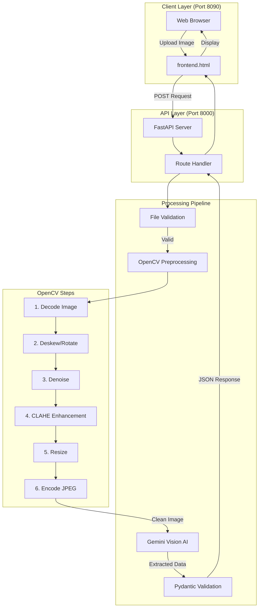

# AI-Based Driver License Data Extraction Module

## Overview

This project is an AI-powered module that extracts structured data from driver license images of various formats and layouts, returning a standardized JSON response. It leverages advanced image preprocessing (OpenCV) and Google Gemini Vision AI for robust field extraction, even from noisy, rotated, or damaged images.

---

## How OpenCV Is Used

OpenCV is central to the image preprocessing pipeline:

- **Deskewing**: Detects and corrects image rotation/skew for better OCR and AI extraction.
- **Denoising**: Removes noise using `fastNlMeansDenoisingColored` for clearer text regions.
- **Contrast Enhancement**: Applies CLAHE (Contrast Limited Adaptive Histogram Equalization) to improve text visibility.
- **Resizing & Color Conversion**: Ensures images are in optimal format and size for extraction.

All these steps are implemented in `app/preprocessing.py` and are automatically applied to uploaded images before AI extraction.

---

## Expected Deliverables

- **API Endpoint**: `/documents/driver-license/parse` (POST) — Accepts an image and returns extracted fields in JSON.
- **Standardized JSON Output**: Includes all readable fields (name, DOB, license number, address, expiry, etc.), confidence scores, reliability, and warnings for missing/uncertain fields.
- **Robust Extraction**: Handles blurry, rotated, multi-language, and damaged licenses.
- **Field Normalization**: Dates, license numbers, gender, and country codes are normalized for consistency.

---

## How to Run the Code


### Prerequisites

- Python 3.8+
- Install dependencies:
	```
	pip install -r requirements.txt
	```
- Set up environment variables in a `.env` file:
	```
	GEMINI_API_KEY=your_google_gemini_api_key
	MODEL_NAME=gemini-2.5-flash-lite
	```

### How to Run

#### 1. Start the Backend (API)

Open a terminal and run:
```
uvicorn app.main:app --port 8000
```

#### 2. Start the Frontend

Open a different terminal and run:
```
python -m http.server 8090
```

#### 3. Access the Application

Open your browser and go to:
```
http://localhost:8090/frontend.html
```

Upload a driver license image and view the extracted data directly in the browser. The frontend will communicate with the backend at port 8000.

---

---

## Architecture Overview

### System Architecture Diagram



### Data Flow

```
User Upload → Frontend (8090) → FastAPI (8000) → File Validation → 
OpenCV Pipeline (Deskew → Denoise → CLAHE → Resize) → 
Gemini Vision AI → Pydantic Validation → JSON Response → Display
```

For detailed architecture documentation, see [docs/architecture.md](docs/architecture.md).

---

## Edge Cases Handled

The system is designed to handle real-world challenges:

### 1. Image Quality Issues
- ✅ Blurry or low-resolution images (upscaled to 1024px, CLAHE enhancement)
- ✅ Noisy images (fastNlMeansDenoisingColored)
- ✅ Poor contrast (CLAHE on LAB color space)

### 2. Orientation Problems
- ✅ Rotated images (automatic deskewing with 0.5° threshold)
- ✅ Skewed images (minAreaRect detection)
- ✅ Upside-down licenses (AI recognizes inverted text)

### 3. Data Variations
- ✅ Missing fields (all fields optional, warnings provided)
- ✅ Different label formats (50+ label variations supported)
- ✅ Multi-language licenses (Hindi, Tamil, Arabic, French, etc.)
- ✅ Date format variations (all normalized to YYYY-MM-DD)

### 4. Character Recognition
- ✅ Character confusion (0 vs O, 1 vs I, 5 vs S, 8 vs B)
- ✅ Partially damaged text (context-based inference)
- ✅ Faded or worn licenses (confidence scoring)

### 5. File Handling
- ✅ Invalid file types (MIME type validation)
- ✅ Empty files (size validation)
- ✅ Corrupted images (exception handling with fallback)

### 6. API Failures
- ✅ Network timeouts (graceful error handling)
- ✅ Invalid JSON responses (regex-based parsing)
- ✅ Rate limits (fallback response structure)

### 7. Country-Specific
- ✅ Different layouts (US, India, UK, Australia)
- ✅ State variations (50 US states + international)
- ✅ ISO country codes (auto-detection)

**Confidence & Reliability:**
- Each field has a confidence score (0.0 to 1.0)
- Reliability classification (high/low based on 0.7 threshold)
- Warnings for missing or low-confidence fields
- No hallucination (fields set to `null` if unreadable)

For complete edge case documentation, see [docs/edge_cases.md](docs/edge_cases.md).

---

## File Structure

```
AI-Based-Driver-License-Data-Extraction-Module/
├── app/
│   ├── main.py              # FastAPI app initialization
│   ├── routes.py            # API endpoint definitions
│   ├── preprocessing.py     # OpenCV image processing pipeline
│   ├── extractor.py         # Gemini Vision AI extraction logic
│   └── schemas.py           # Pydantic validation models
├── docs/
│   ├── architecture.md      # Detailed architecture documentation
│   ├── edge_cases.md        # Comprehensive edge case analysis
│   ├── assumptions.md       # System assumptions
│   └── limitations.md       # Current limitations
├── tests/
│   ├── test_api.py          # API endpoint tests
│   ├── test_extractor.py    # Extraction logic tests
│   ├── test_preprocessing.py # OpenCV pipeline tests
│   └── test_pipeline.py     # End-to-end integration tests
├── frontend.html            # Web interface for image upload
├── requirements.txt         # Python dependencies
├── .env                     # Environment variables (API keys)
└── README.md               # This file
```

---

## OpenCV Processing Pipeline

The preprocessing module (`app/preprocessing.py`) uses the following OpenCV functions:

1. **`cv2.cvtColor`** - Color space conversion (RGB ↔ GRAY ↔ LAB)
2. **`cv2.threshold`** - Binary thresholding with Otsu's method
3. **`cv2.minAreaRect`** - Detect rotation angle from text regions
4. **`cv2.getRotationMatrix2D`** - Create 2D rotation matrix
5. **`cv2.warpAffine`** - Apply affine transformation (rotation)
6. **`cv2.fastNlMeansDenoisingColored`** - Remove image noise
7. **`cv2.createCLAHE`** - Contrast Limited Adaptive Histogram Equalization
8. **`cv2.resize`** - Upscale low-resolution images

All operations are optimized for text clarity and AI readability.

---

## API Response Format

```json
{
  "documentType": "driver_license",
  "fullName": "John Doe",
  "licenseNumber": "DL1234567890",
  "dateOfBirth": "1990-01-15",
  "issueDate": "2020-01-01",
  "expiryDate": "2030-01-01",
  "gender": "M",
  "address": "123 Main St, City, State, ZIP",
  "issuingAuthority": "Department of Motor Vehicles",
  "country": "US",
  "state": "California",
  "confidenceScores": {
    "fullName": 0.95,
    "licenseNumber": 1.0,
    "dateOfBirth": 0.92,
    "issueDate": 0.88,
    "expiryDate": 0.90,
    "gender": 1.0,
    "address": 0.75,
    "issuingAuthority": 0.85
  },
  "warnings": [
    "address: low confidence 0.75"
  ]
}
```

---

## Contact & Support

For issues or feature requests, please open an issue in this repository.

**Documentation:**
- [Architecture Details](docs/architecture.md)
- [Edge Cases](docs/edge_cases.md)
- [Assumptions](docs/assumptions.md)
- [Limitations](docs/limitations.md)
