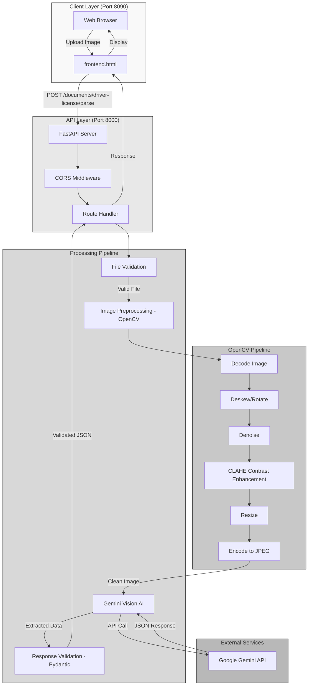

# System Architecture

This document describes the architecture of the AI-Based Driver License Data Extraction Module.

---

## Architecture Overview



---

## Component Details

### 1. Client Layer (Frontend)

**Technology**: HTML5, JavaScript, CSS

**Responsibilities**:
- Provide user interface for image upload
- Send HTTP POST request with image file
- Display extracted JSON response

**Files**:
- `frontend.html` - Single-page application

**Port**: 8090 (served via Python HTTP server)

---

### 2. API Layer (Backend)

**Technology**: FastAPI, Python 3.8+

**Responsibilities**:
- Handle HTTP requests
- Validate file types and sizes
- Route requests to processing pipeline
- Return standardized JSON responses

**Files**:
- `app/main.py` - FastAPI app initialization
- `app/routes.py` - API endpoint definitions

**Port**: 8000 (served via Uvicorn)

**Key Endpoints**:
| Method | Endpoint | Description |
|--------|----------|-------------|
| GET | `/` | Health check |
| POST | `/documents/driver-license/parse` | Extract license data |

---

### 3. Image Preprocessing Layer (OpenCV)

**Technology**: OpenCV, NumPy, PIL

**Responsibilities**:
- Clean and enhance images for better extraction
- Fix rotation and skew
- Reduce noise
- Improve contrast and resolution

**Files**:
- `app/preprocessing.py`

**Pipeline Steps**:
1. **Decode**: Convert bytes to NumPy array
2. **Deskew**: Detect and fix rotation (threshold: 0.5°)
3. **Denoise**: Apply fast non-local means denoising
4. **Enhance**: CLAHE on LAB color space (L channel only)
5. **Resize**: Upscale to minimum 1024px width
6. **Encode**: Convert back to JPEG bytes (quality: 95%)

**OpenCV Functions Used**:
- `cv2.cvtColor` - Color space conversion
- `cv2.threshold` - Binary thresholding with Otsu's method
- `cv2.minAreaRect` - Find minimum area rectangle for rotation angle
- `cv2.getRotationMatrix2D` - Create rotation matrix
- `cv2.warpAffine` - Apply rotation transformation
- `cv2.fastNlMeansDenoisingColored` - Denoise color images
- `cv2.createCLAHE` - Contrast enhancement
- `cv2.resize` - Image scaling

---

### 4. Data Extraction Layer (AI)

**Technology**: Google Gemini Vision API

**Responsibilities**:
- Analyze processed image
- Extract all visible text fields
- Normalize data formats
- Provide confidence scores

**Files**:
- `app/extractor.py`

**Model**: `gemini-2.5-flash-lite` (configurable via `.env`)

**Extraction Steps**:
1. **API Call**: Send image + prompt to Gemini
2. **Parse**: Extract JSON from response (handles markdown)
3. **Sanitize**: Clean warnings array
4. **Validate**: Add warnings for missing/low-confidence fields
5. **Fallback**: Return structured error on failure

**Prompt Engineering**:
- 12 detailed extraction rules
- 50+ label variations
- Country-specific field locations
- Character disambiguation guidelines
- Multi-language support instructions

---

### 5. Validation Layer (Pydantic)

**Technology**: Pydantic v2

**Responsibilities**:
- Enforce response schema
- Normalize field values
- Flatten nested structures
- Ensure type consistency

**Files**:
- `app/schemas.py`

**Models**:
- `DriverLicenseResponse` - Main response schema
- `ConfidenceScores` - Confidence scores for each field

**Field Validators**:
- `normalize_gender` - Convert to M/F only
- `flatten_address` - Convert nested address dict to string
- `handle_confidence` - Ensure confidence scores object exists

---

## Data Flow

```
User Uploads Image
   ↓
Frontend (HTML/JS) - Port 8090
   ↓ [HTTP POST]
FastAPI Route Handler - Port 8000
   ↓
File Validation (type, size)
   ↓
OpenCV Preprocessing Pipeline
   ├─ Decode Image
   ├─ Deskew (rotation fix)
   ├─ Denoise (noise removal)
   ├─ CLAHE (contrast enhancement)
   ├─ Resize (upscale if needed)
   └─ Encode to JPEG
   ↓
Gemini Vision AI Extraction
   ├─ API Call with Image + Prompt
   ├─ Parse JSON Response
   ├─ Sanitize Warnings
   └─ Add Validation Warnings
   ↓
Pydantic Schema Validation
   ├─ Enforce Field Types
   ├─ Normalize Values
   └─ Flatten Structures
   ↓
JSON Response
   ↓
Frontend Display
```

---

## Error Handling Strategy

### 1. Validation Errors (400)
- Invalid file type
- Empty file
- Missing required parameters

### 2. Processing Errors (422)
- Preprocessing failure
- Image decode failure
- Still returns partial response with warnings

### 3. Extraction Errors (200 with warnings)
- Gemini API failure
- JSON parse failure
- Returns fallback response with all fields as `null`

---

## Configuration

**Environment Variables** (`.env` file):
```
GEMINI_API_KEY=your_google_gemini_api_key
MODEL_NAME=gemini-2.5-flash-lite
```

**Dependencies** (`requirements.txt`):
- `fastapi` - Web framework
- `uvicorn` - ASGI server
- `opencv-python` - Image processing
- `Pillow` - Image I/O
- `google-generativeai` - Gemini API client
- `pydantic` - Data validation
- `python-dotenv` - Environment management

---

## Deployment Architecture

```
[Frontend Server]          [Backend Server]          [External API]
Port 8090                  Port 8000                 Google Cloud
   |                           |                           |
   |<---- HTTP Server ---->    |<---- FastAPI ---->        |
   |                           |                           |
   |                           |<---- Gemini API Call ---->|
   |<---- JSON Response ------|                           |
```

---

## Security Considerations

1. **API Key Protection**: Stored in `.env` file (not committed to repo)
2. **CORS Policy**: Configured to allow frontend origin
3. **No Data Storage**: Images processed in memory only
4. **Input Validation**: File type and size checks before processing
5. **Error Sanitization**: Sensitive error details not exposed to client

---

## Performance Characteristics

**Expected Latency**:
- Image Preprocessing: 1-3 seconds
- Gemini API Call: 2-5 seconds
- Total Response Time: 3-8 seconds

**Bottlenecks**:
- Gemini API call (network + AI processing)
- OpenCV denoising (computationally intensive)

**Optimization Opportunities**:
- Cache API responses for identical images
- Batch processing for multiple images
- Parallel preprocessing steps
- CDN for frontend static files

---

## Scalability Considerations

**Current Limitations**:
- Synchronous processing (one request at a time)
- Gemini API rate limits
- Single-server deployment

**Scaling Strategies**:
- Horizontal scaling with load balancer
- Async processing with task queue (Celery + Redis)
- Multiple API keys for rate limit distribution
- Container deployment (Docker + Kubernetes)

---

## Testing Strategy

**Unit Tests**:
- `tests/test_preprocessing.py` - OpenCV pipeline
- `tests/test_extractor.py` - Extraction logic
- `tests/test_api.py` - API endpoints

**Integration Tests**:
- `tests/test_pipeline.py` - End-to-end workflow

**Test Coverage**:
- Image preprocessing edge cases
- API error scenarios
- Schema validation
- Multi-format date parsing

---

## Monitoring and Logging

**Logging Strategy**:
- Request/response logging
- Error tracking with stack traces
- Performance metrics (response time)

**Metrics to Track**:
- Success rate
- Average response time
- Confidence score distribution
- Field extraction success rate
- Error type frequency

---

## Future Enhancements

1. **Multi-Document Support**: Passports, ID cards, vehicle registration
2. **Batch Upload**: Process multiple licenses at once
3. **Real-Time Preview**: Show processed image before extraction
4. **Confidence Threshold Adjustment**: User-configurable threshold
5. **Export Options**: CSV, Excel, PDF reports
6. **OCR Fallback**: Tesseract OCR if Gemini fails
7. **Database Integration**: Store extraction history
8. **User Authentication**: API key management for users
