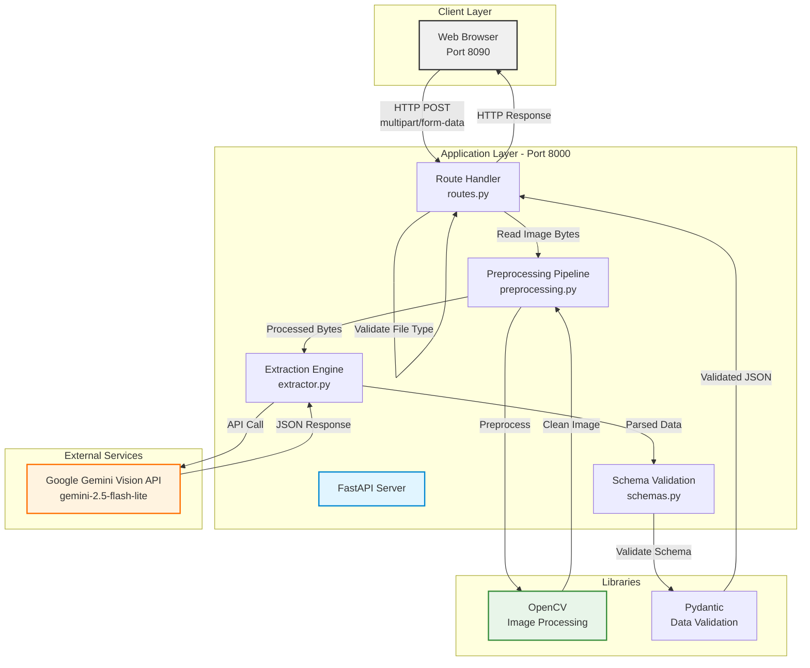
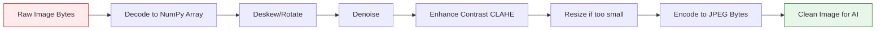
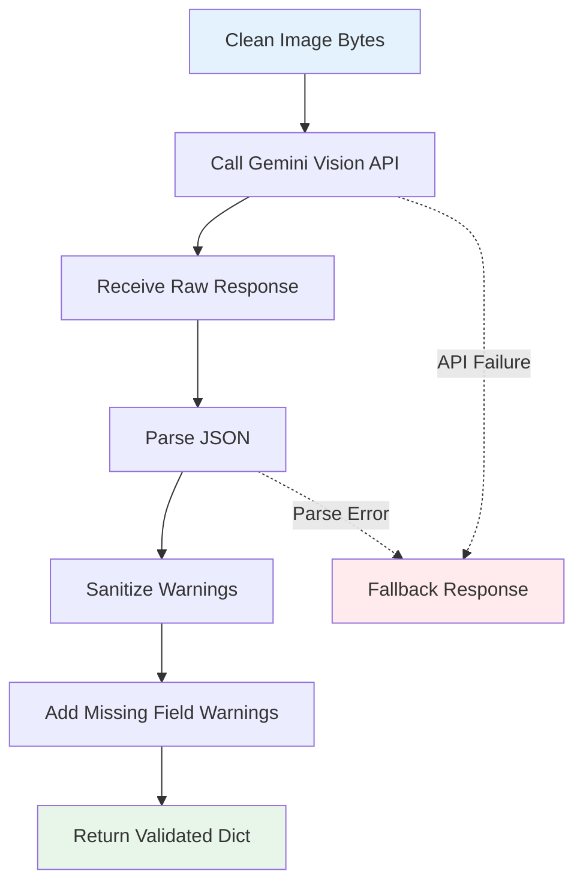
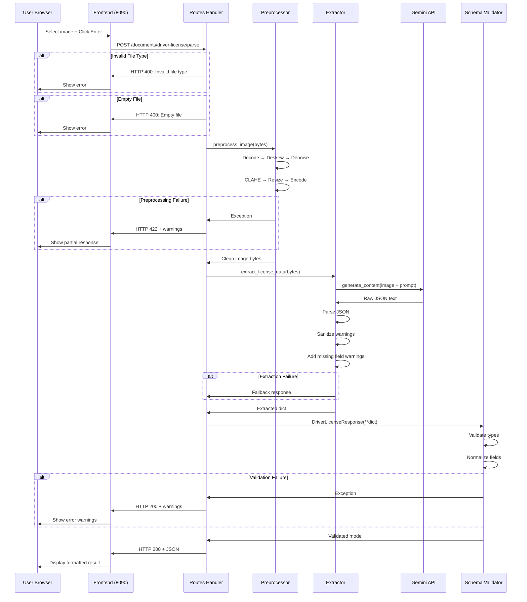

# Architecture Documentation - AI-Based Driver License Data Extraction Module

## Table of Contents
1. [System Overview](#system-overview)
2. [High-Level Architecture](#high-level-architecture)
3. [Component Details](#component-details)
4. [Data Flow](#data-flow)
5. [Technology Stack](#technology-stack)
6. [Deployment Architecture](#deployment-architecture)

---

## System Overview

The AI-Based Driver License Data Extraction Module is a full-stack application that processes driver license images and extracts structured data using computer vision (OpenCV) and AI (Google Gemini Vision). The system consists of:

- **Frontend**: HTML/JavaScript interface for image upload and result display
- **Backend**: FastAPI REST API with preprocessing and extraction logic
- **AI Engine**: Google Gemini Vision API for intelligent field extraction
- **Image Processing**: OpenCV pipeline for image optimization

---

## High-Level Architecture



---

## Component Details

### 1. Frontend (frontend.html)

**Purpose**: User interface for image upload and result visualization

**Technologies**:
- Pure HTML/CSS/JavaScript (no frameworks)
- Fetch API for HTTP requests
- Black and white minimalist design

**Key Features**:
- File input with image type restriction
- Single-click submission ("Enter" button)
- Loading indicator during processing
- JSON output display with syntax highlighting

**Port**: 8090 (served via Python HTTP server)

**API Endpoint Called**:
```javascript
POST http://localhost:8000/documents/driver-license/parse
Content-Type: multipart/form-data
```

---

### 2. FastAPI Backend (app/main.py, app/routes.py)

**Purpose**: RESTful API server handling requests and orchestrating processing

**Key Responsibilities**:
- Request validation and error handling
- CORS middleware configuration
- Routing to appropriate handlers
- Response formatting

**Endpoints**:
| Endpoint | Method | Purpose |
|----------|--------|---------|
| `/` | GET | Health check |
| `/documents/driver-license/parse` | POST | Driver license extraction |

**Error Handling**:
- HTTP 400: Invalid file type or empty file
- HTTP 422: Preprocessing failure
- HTTP 200 with warnings: Extraction/validation errors

**CORS Configuration**:
```python
allow_origins=["*"]  # Production should restrict
allow_methods=["*"]
allow_headers=["*"]
```

---

### 3. Preprocessing Pipeline (app/preprocessing.py)

**Purpose**: Image enhancement using OpenCV to improve AI extraction accuracy

**Architecture**:



**Detailed Pipeline Steps**:

#### Step 1: Image Decoding
```python
def _decode_image(file_bytes: bytes) -> np.ndarray
```
- Converts bytes to PIL Image
- Converts to RGB color space
- Returns NumPy array for OpenCV processing

#### Step 2: Deskewing
```python
def _deskew(img: np.ndarray) -> np.ndarray
```
**Algorithm**:
1. Convert to grayscale
2. Apply Otsu's thresholding to detect text regions
3. Find minimum area rectangle around text blobs
4. Calculate rotation angle (-45° to +45°)
5. Apply affine transformation if angle > 0.5°

**OpenCV Functions**:
- `cv2.cvtColor()` - Color space conversion
- `cv2.threshold()` - Binary thresholding
- `cv2.minAreaRect()` - Detect rotation angle
- `cv2.getRotationMatrix2D()` - Create rotation matrix
- `cv2.warpAffine()` - Apply rotation

**Why Important**: Skewed text drastically reduces OCR accuracy

#### Step 3: Denoising
```python
def _denoise(img: np.ndarray) -> np.ndarray
```
**Algorithm**: Non-Local Means Denoising
- `h=10`: Filter strength for luminance channel
- `hColor=10`: Filter strength for color channels
- `templateWindowSize=7`: Size for computing weights
- `searchWindowSize=21`: Area for searching similar patches

**Why Important**: Removes compression artifacts, camera noise, and grain

#### Step 4: Contrast Enhancement (CLAHE)
```python
def _enhance_contrast(img: np.ndarray) -> np.ndarray
```
**Algorithm**: Contrast Limited Adaptive Histogram Equalization
1. Convert RGB to LAB color space
2. Split into L (lightness), A, B channels
3. Apply CLAHE to L-channel only
4. Merge channels and convert back to RGB

**Parameters**:
- `clipLimit=2.0`: Prevents over-amplification
- `tileGridSize=(8,8)`: Local region size

**Why Important**: Equalizes lighting variations, improves text visibility

#### Step 5: Resizing
```python
def _resize(img: np.ndarray, min_width=1024) -> np.ndarray
```
- Upscales images with width < 1024px
- Maintains aspect ratio
- Uses cubic interpolation for quality

**Why Important**: Low-resolution images lack detail for accurate extraction

#### Step 6: JPEG Encoding
```python
def _to_jpeg_bytes(img: np.ndarray) -> bytes
```
- Converts NumPy array back to PIL Image
- Encodes as JPEG with 95% quality
- Returns bytes for API transmission

---

### 4. Extraction Engine (app/extractor.py)

**Purpose**: Leverages Google Gemini Vision AI for intelligent field extraction

**Architecture**:



**Pipeline Functions**:

#### Step 1: Gemini API Call
```python
def _call_gemini(image_bytes: bytes) -> str
```
- Creates multimodal request (image + text prompt)
- Uses model: `gemini-2.5-flash-lite`
- Sends JPEG image with extraction prompt
- Returns raw text response

**API Structure**:
```python
client.models.generate_content(
    model=MODEL,
    contents=[
        Part.from_bytes(data=image_bytes, mime_type="image/jpeg"),
        EXTRACTION_PROMPT
    ]
)
```

#### Step 2: JSON Parsing
```python
def _parse_json_response(raw: str) -> dict
```
**Cleaning Steps**:
1. Remove markdown code blocks (```json, ```)
2. Attempt direct JSON parsing
3. If failed, regex search for JSON object
4. Extract and parse matched JSON

**Handles**:
- Markdown-wrapped JSON
- Extra text before/after JSON
- Gemini explanations mixed with JSON

#### Step 3: Warning Sanitization
```python
def _sanitize_warnings(data: dict) -> dict
```
- Converts all warning formats to List[str]
- Handles dict-based warnings: `{"field": "name", "message": "unclear"}`
- Converts to: `"name: unclear"`

#### Step 4: Automatic Warning Generation
```python
def _add_warnings(data: dict) -> dict
```
**Logic**:
- Iterate through mandatory fields
- Check if value is null → add "Missing field" warning
- Check confidence score < 0.7 → add "Low confidence" warning

**Mandatory Fields**:
- fullName, licenseNumber, dateOfBirth
- issueDate, expiryDate, address, issuingAuthority

#### Fallback Response
```python
def _fallback_response(error_msg: str) -> dict
```
- Returns valid JSON structure with all fields null
- Includes error message in warnings array
- Ensures system never returns unstructured errors

---

### 5. Prompt Engineering (app/extractor.py)

**Purpose**: Comprehensive instructions to guide Gemini's extraction

**Prompt Structure** (2,800 tokens):

```
┌─────────────────────────────────────┐
│  EXTRACTION RULES (12 rules)       │
│  - Output format specifications    │
│  - Field normalization rules       │
│  - Confidence scoring guidelines   │
│  - Multi-language handling         │
└─────────────────────────────────────┘
           ↓
┌─────────────────────────────────────┐
│  LABEL VARIATIONS (50+ patterns)   │
│  - Name: Full Name, Holder Name... │
│  - DOB: Date of Birth, D.O.B...   │
│  - License: DL No, Lic. No...      │
└─────────────────────────────────────┘
           ↓
┌─────────────────────────────────────┐
│  OUTPUT JSON SCHEMA                 │
│  - Exact structure with null values│
│  - confidenceScores object         │
│  - warnings array                  │
└─────────────────────────────────────┘
```

**Key Prompt Rules**:

| Rule | Purpose | Impact |
|------|---------|--------|
| RULE 1 | JSON-only output | Prevents wrapped responses |
| RULE 2 | Never guess/hallucinate | Ensures accuracy |
| RULE 3 | Date normalization | Standardizes YYYY-MM-DD |
| RULE 4 | License number cleaning | Removes special characters |
| RULE 5 | Gender normalization | Returns M/F only |
| RULE 6 | Country code detection | ISO 2-letter codes |
| RULE 7 | Confidence scoring | 0.0-1.0 granular scores |
| RULE 8 | Warning generation | Lists missing/low fields |
| RULE 9 | Label variations | Handles 50+ label formats |
| RULE 10 | Blurry handling | Character disambiguation |
| RULE 11 | Multi-language | Transliteration support |
| RULE 12 | Location awareness | Country-specific layouts |

---

### 6. Schema Validation (app/schemas.py)

**Purpose**: Type safety, data normalization, and validation using Pydantic

**Schema Architecture**:

```python
DriverLicenseResponse
    ├── documentType: str = "driver_license"
    ├── fullName: Optional[str]
    ├── licenseNumber: Optional[str]
    ├── dateOfBirth: Optional[str]
    ├── issueDate: Optional[str]
    ├── expiryDate: Optional[str]
    ├── gender: Optional[str]
    ├── address: Optional[str]
    ├── issuingAuthority: Optional[str]
    ├── country: Optional[str]
    ├── state: Optional[str]
    ├── confidenceScores: ConfidenceScores
    │   ├── fullName: Optional[float]
    │   ├── licenseNumber: Optional[float]
    │   ├── dateOfBirth: Optional[float]
    │   └── ... (8 fields)
    └── warnings: List[str]
```

**Field Validators**:

#### Address Flattening
```python
@field_validator("address", mode="before")
def flatten_address(cls, v: Any) -> Optional[str]
```
**Handles**: Gemini sometimes returns address as nested dict
```json
{
  "street": "123 Main St",
  "city": "New York",
  "state": "NY",
  "zip": "10001"
}
```
**Converts to**: `"123 Main St, New York, NY, 10001"`

#### Gender Normalization
```python
@field_validator("gender", mode="before")
def normalize_gender(cls, v: Any) -> Optional[str]
```
**Handles**:
- "Male" / "MALE" → "M"
- "Female" / "FEMALE" → "F"
- Invalid values → None

#### Confidence Score Handling
```python
@field_validator("confidenceScores", mode="before")
def handle_confidence(cls, v: Any) -> Any
```
**Ensures**: Always returns ConfidenceScores object, never null

---

## Data Flow

### End-to-End Request Flow



**Timing Breakdown** (typical request):
1. Upload: 100-500ms (network)
2. Preprocessing: 500-1500ms (OpenCV)
3. Gemini API: 2000-5000ms (AI inference)
4. Validation: 10-50ms (Pydantic)
5. Total: ~3-7 seconds

---

## Technology Stack

### Backend Stack

| Component | Technology | Version | Purpose |
|-----------|-----------|---------|---------|
| Web Framework | FastAPI | Latest | Async API server |
| Image Processing | OpenCV (cv2) | Latest | Preprocessing pipeline |
| Image I/O | Pillow (PIL) | Latest | Image encoding/decoding |
| AI Engine | Google Gemini | 2.5-flash-lite | Field extraction |
| Validation | Pydantic | v2.x | Schema validation |
| Environment | python-dotenv | Latest | Config management |
| HTTP Client | httpx | Latest | Testing |
| Testing | pytest | Latest | Unit tests |
| Math | NumPy | Latest | Array operations |
| ML Utils | scikit-learn, joblib | Latest | Future enhancements |

### Frontend Stack

| Component | Technology | Purpose |
|-----------|-----------|---------|
| UI | HTML5 | Structure |
| Styling | CSS3 | Black/white theme |
| Logic | Vanilla JavaScript | API calls, DOM manipulation |
| HTTP | Fetch API | Async requests |
| Server | Python http.server | Static file serving |

### Infrastructure

| Component | Technology | Configuration |
|-----------|-----------|---------------|
| Web Server | Uvicorn | ASGI server, port 8000 |
| Static Server | Python http.server | Port 8090 |
| Environment | Python 3.8+ | Virtual environment |
| API Integration | Google Gemini SDK | REST API client |

---

## Deployment Architecture

### Development Environment

```
┌─────────────────────────────────────────────────┐
│  Developer Machine (Windows)                    │
│                                                  │
│  ┌─────────────────┐    ┌──────────────────┐   │
│  │ Terminal 1      │    │ Terminal 2       │   │
│  │                 │    │                  │   │
│  │ Backend:        │    │ Frontend:        │   │
│  │ uvicorn         │    │ http.server      │   │
│  │ Port 8000       │    │ Port 8090        │   │
│  └─────────────────┘    └──────────────────┘   │
│                                                  │
│  ┌──────────────────────────────────────────┐  │
│  │ Browser: localhost:8090/frontend.html    │  │
│  └──────────────────────────────────────────┘  │
└─────────────────────────────────────────────────┘
                     │
                     ↓
        ┌────────────────────────┐
        │ Google Gemini API      │
        │ (External Service)     │
        └────────────────────────┘
```

### Production Architecture (Recommended)

```
┌──────────────────────────────────────────────────┐
│  Load Balancer / Reverse Proxy (Nginx)          │
│  - SSL Termination                               │
│  - Rate Limiting                                 │
│  - Static File Serving                           │
└──────────────────────────────────────────────────┘
                     │
         ┌───────────┴──────────┐
         ↓                      ↓
┌─────────────────┐    ┌─────────────────┐
│ FastAPI         │    │ FastAPI         │
│ Instance 1      │    │ Instance 2      │
│ (Gunicorn +     │    │ (Gunicorn +     │
│  Uvicorn)       │    │  Uvicorn)       │
└─────────────────┘    └─────────────────┘
         │                      │
         └───────────┬──────────┘
                     ↓
         ┌───────────────────────┐
         │ Redis Cache (Future)  │
         │ - API Response Cache  │
         │ - Rate Limit Tracking │
         └───────────────────────┘
                     │
                     ↓
         ┌───────────────────────┐
         │ Google Gemini API     │
         │ - Multiple API Keys   │
         │ - Request Pooling     │
         └───────────────────────┘
```

### Environment Variables (.env)

```bash
# Required
GEMINI_API_KEY=your_api_key_here

# Optional (with defaults)
MODEL_NAME=gemini-2.5-flash-lite
PORT=8000

# Production additions
CORS_ORIGINS=https://yourdomain.com
MAX_FILE_SIZE=10485760  # 10MB
API_TIMEOUT=30
REDIS_URL=redis://localhost:6379
```

---

## Security Considerations

### Current Implementation

| Aspect | Status | Notes |
|--------|--------|-------|
| HTTPS | ❌ | HTTP only in dev |
| Input Validation | ✅ | File type + size checks |
| CORS | ⚠️ | Allow all origins (insecure) |
| API Key Security | ✅ | Environment variable |
| File Upload Limits | ⚠️ | FastAPI default only |
| Rate Limiting | ❌ | Not implemented |
| Authentication | ❌ | Public endpoint |
| PII Logging | ✅ | No sensitive data logged |

### Production Recommendations

1. **Enable HTTPS**: Use SSL/TLS certificates
2. **Restrict CORS**: Whitelist specific domains only
3. **Add Authentication**: OAuth2 or API key auth
4. **Implement Rate Limiting**: Prevent abuse
5. **File Size Limits**: Max 10MB uploads
6. **Input Sanitization**: Validate all user inputs
7. **Monitoring**: Log suspicious activities
8. **API Key Rotation**: Regular key updates

---

## Performance Optimization

### Current Bottlenecks

1. **OpenCV Processing**: CPU-intensive (500-1500ms)
2. **Gemini API Call**: Network latency (2000-5000ms)
3. **Sequential Processing**: No parallelization
4. **No Caching**: Repeat uploads reprocess

### Optimization Strategies

#### 1. Request Caching
```python
# Cache preprocessed images (Redis)
image_hash = hashlib.md5(file_bytes).hexdigest()
if cached := redis.get(f"processed:{image_hash}"):
    return cached
```

#### 2. Background Processing
```python
# Celery task queue for long-running jobs
@celery_app.task
def process_license(image_bytes):
    return extract_license_data(image_bytes)
```

#### 3. GPU Acceleration
```python
# OpenCV with CUDA support
cv2.cuda.setDevice(0)
preprocessor = cv2.cuda_GpuMat()
```

#### 4. Connection Pooling
```python
# Reuse HTTP connections to Gemini
session = httpx.AsyncClient(timeout=30, limits=httpx.Limits(max_connections=100))
```

---

## Monitoring and Observability

### Key Metrics to Track

1. **Request Metrics**:
   - Requests per minute
   - Average response time
   - Error rate (4xx, 5xx)

2. **Processing Metrics**:
   - Preprocessing duration
   - Gemini API latency
   - Validation time

3. **Business Metrics**:
   - Successful extractions
   - Fields with low confidence
   - Most common warning types

4. **System Metrics**:
   - CPU usage (OpenCV)
   - Memory usage
   - Network I/O

### Logging Strategy

```python
import logging

logger = logging.getLogger(__name__)

# Structure logs for analysis
logger.info("extraction_complete", extra={
    "processing_time_ms": elapsed,
    "confidence_avg": avg_confidence,
    "warnings_count": len(warnings),
    "country_detected": country
})
```

---

## Future Enhancements

### 1. Multi-Document Support
- Passport extraction
- National ID cards
- Vehicle registration

### 2. Batch Processing
- Multiple image upload
- ZIP file support
- Asynchronous processing queue

### 3. Enhanced Validation
- Checksum validation for license numbers
- Date range validation
- Address verification APIs

### 4. AI Model Improvements
- Fine-tuned model for licenses
- Ensemble predictions
- Confidence calibration

### 5. User Features
- Image preview before processing
- Edit extracted fields
- Export to CSV/PDF
- Audit trail

---

## Conclusion

The architecture demonstrates a well-structured, modular design with clear separation of concerns. The pipeline effectively combines computer vision preprocessing with AI-powered extraction to achieve robust driver license data extraction across diverse formats and quality conditions.

**Strengths**:
- Comprehensive preprocessing pipeline using OpenCV
- Extensive prompt engineering for Gemini
- Strong validation and error handling
- Graceful degradation on failures

**Areas for Enhancement**:
- Add caching and async processing
- Implement authentication and rate limiting
- Enhanced monitoring and observability
- Production deployment configuration
